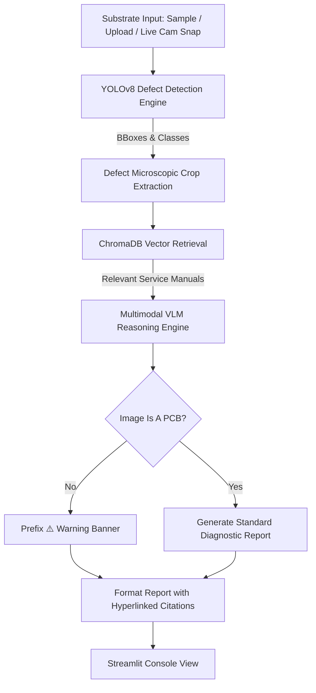

# DeepPCB-Inference-VLM-Diagnostics: Multimodal RAG-Driven Diagnostic Dashboard for Semiconductor & PCB Defect Inspection

DeepPCB-Inference-VLM-Diagnostics is a production-grade, brand-neutral **Automated Optical Inspection (AOI) Diagnostic Console**. It integrates high-speed edge Computer Vision (YOLOv8) with Multimodal Retrieval-Augmented Generation (RAG) to automate defect classification, root-cause diagnosis, and step-by-step field repair recommendations.

---

## 🚀 Key Features

* **Real-Time Edge Computer Vision**: Runs a custom-trained **YOLOv8** model to detect, localize, and classify 6 critical printed circuit board (PCB) defect categories: *Open Circuit, Short Circuit, Mousebite, Spur, Spurious Copper, and Pin-hole*.
* **Vector-DB Retrieval-Augmented Generation**: Chunks, indexes, and queries technical engineering manuals using **ChromaDB** and the `all-MiniLM-L6-v2` transformer model, retrieving context-specific diagnostic steps in real time.
* **Multimodal AI Reasoning**: Leverages **Gemini 3.5 Flash (Online)** and **Qwen2-VL (Offline via local vLLM)** to analyze microscopic defect crops in conjunction with retrieved manuals.
* **PCB Guardrail Verification**: The reasoning engine validates the input image; if a non-PCB object is presented (e.g., a webcam selfie), it automatically flags it with a warning.
* **Interactive Citation Mapping**: AI-generated reports feature interactive citation tags (e.g., `[manual_short_circuits.txt - Section 1]`) that link directly to collapsible, scrollable source references on the console.
* **Live Camera Stream & Capture**: Live stream preview with bounding box overlays, inference FPS benchmarking, and a one-click **📸 Capture Frame & Process** feature for instant diagnosis.
* **Optimized Execution Paths**: Supports PyTorch FP32, ONNX, and compiled **TensorRT GPU engines** to achieve low-latency edge inference (~10ms/frame).

---

## 🛠️ System Architecture



---

## 📦 Installation & Setup

### 1. Clone & Setup Environment
Ensure Python 3.10+ is installed on your Linux machine.

```bash
git clone https://github.com/GaneshKnagal/DeepPCB-Inference-VLM-Diagnostics.git
cd DeepPCB-Inference-VLM-Diagnostics

# Create and activate virtual environment
python3 -m venv .venv
source .venv/bin/activate

# Install dependencies
pip install -r requirements.txt
```

### 2. Configure Environment Variables
Create a `.env` file in the root directory:
```env
GEMINI_API_KEY=AIzaSy...your_gemini_api_key_here
```

### 3. Generate Mock Manuals & Initialize Vector Database
Run the helper scripts to set up the knowledge base files and populate ChromaDB:
```bash
# Generate the technical manual text files
python3 create_mock_manuals.py
```
*(ChromaDB is automatically initialized and populated on the first run of the app).*

### 4. Run the Streamlit Dashboard
Launch the dashboard orchestrator:
```bash
chmod +x run_dashboard.sh
./run_dashboard.sh
```
Open `http://localhost:8501` in your web browser.

---

## 📊 Models & Benchmarks

| Inference Format | Avg Latency | Throughput | Deployment Target |
| :--- | :--- | :--- | :--- |
| **PyTorch FP32** | ~45 ms | ~22 FPS | CPU / Edge Server |
| **ONNX Runtime** | ~28 ms | ~35 FPS | Standard Workstation |
| **TensorRT (GPU)**| **~10 ms** | **~100 FPS**| Field Inspection Rigs |

---

## 🐳 Dockerization (Production Deployment)

To deploy the console in a self-contained container:

### `Dockerfile`
Create a `Dockerfile` in the root:
```dockerfile
FROM python:3.10-slim

WORKDIR /app

# Install system dependencies for OpenCV & V4L
RUN apt-get update && apt-get install -y \
    libgl1-mesa-glx \
    libglib2.0-0 \
    v4l-utils \
    && rm -rf /var/lib/apt/lists/*

COPY requirements.txt .
RUN pip install --no-cache-dir -r requirements.txt

COPY . .

EXPOSE 8501

CMD ["streamlit", "run", "app.py", "--server.port=8501", "--server.address=0.0.0.0"]
```

Build and run:
```bash
docker build -t deeppcb-inference-vlm-diagnostics .
docker run -p 8501:8501 --env-file .env --device=/dev/video0:/dev/video0 deeppcb-inference-vlm-diagnostics
```

---

## 📜 License
This project is licensed under the MIT License - see the LICENSE file for details.
